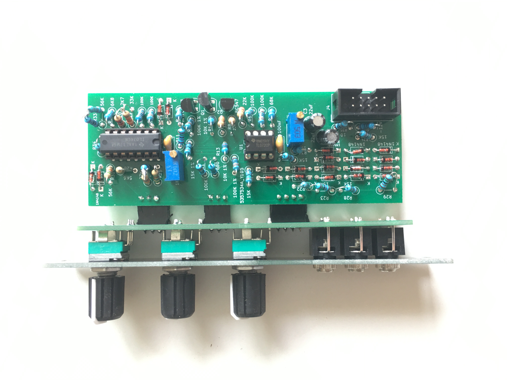
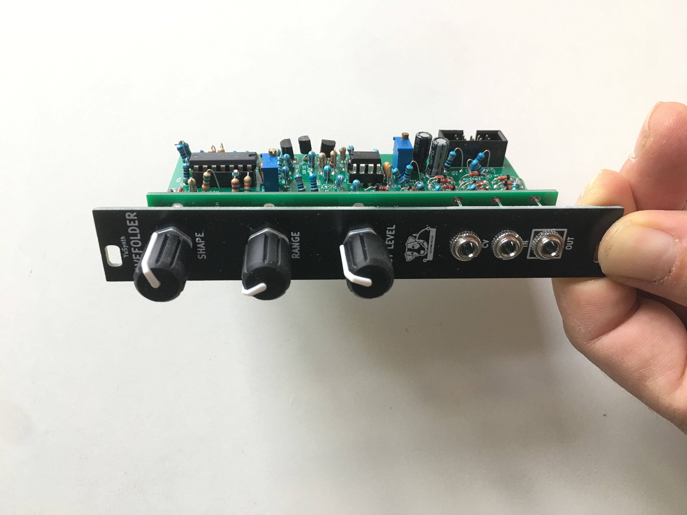

# Yusynth-WaveFolder
Adaptation du Yusynth [WaveFolder](http://yusynth.net/Modular/index_en.html) au format Eurorack

[Build document](https://htmlpreview.github.io/?https://github.com/jojo-monk/Yusynth-WaveFolder/blob/main/ibom.html)

